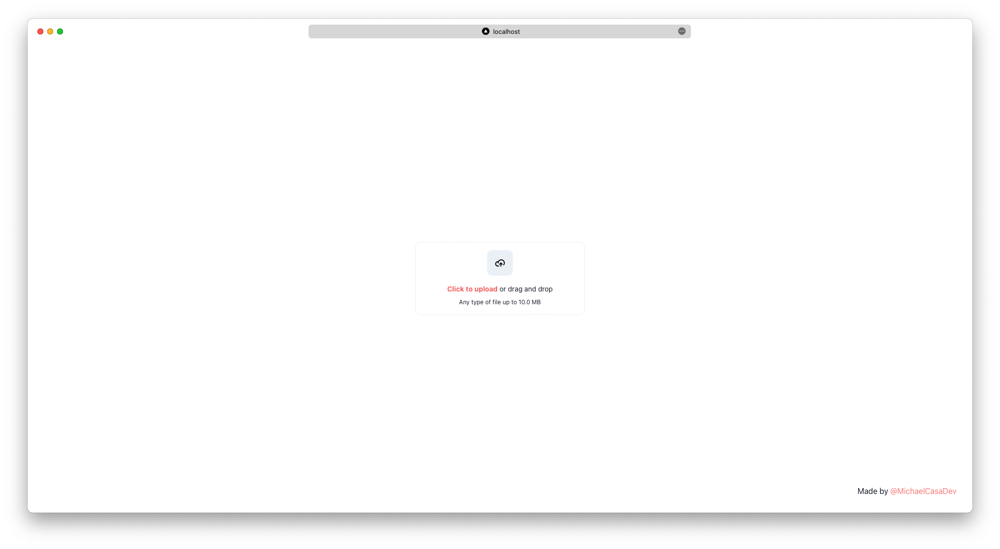

# ChakraUI File Uploader
A simple file uploader component made with ChakraUI

## Component
This component it's only require ChakraUI to works!

Copy and paste in in our project and run it!

 

[Link to the component](FileUploader.tsx)

[Link to the test project](test/pages/index.tsx)

## License

[MIT License](https://github.com/MichaelCasaDev/chakra-file-uploader/blob/main/LICENSE)
